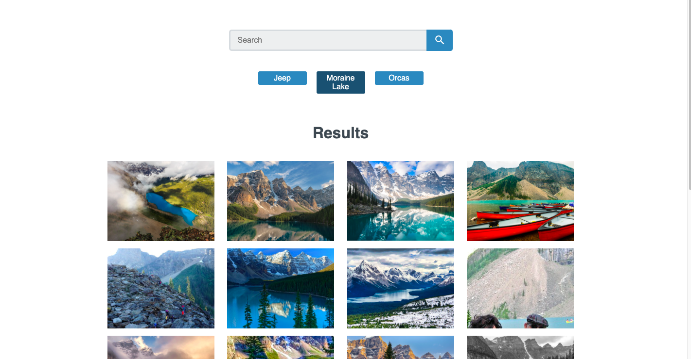
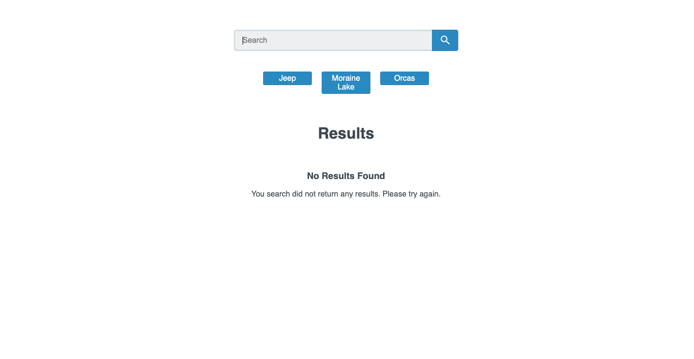

# react-gallery-app

    A react application that retrieves images from the flickr api.

## Table of Contents

- [react-gallery-app](#react-gallery-app)
  - [Table of Contents](#table-of-contents)
  - [Examples](#examples)
  - [Components](#components)
    - [App.js](#appjs)
    - [Header.js](#headerjs)
    - [SearchForm.js](#searchformjs)
    - [Nav.js](#navjs)
    - [PhotoContainer.js](#photocontainerjs)
    - [Error.js](#errorjs)
    - [Loading.js](#loadingjs)
    - [NotFound.js](#notfoundjs)
    - [config.js](#configjs)
  - [CSS](#css)
    - [styles.css](#stylescss)

## Examples

## Components

### App.js

    Main entry point of the application. Uses axios to fetch data from the flicker api.

### Header.js

    Renders the SearchForm and Nav Links

### SearchForm.js

    Allows the user to search for specific images

### Nav.js

    Default search page links of the application.

### PhotoContainer.js

    Recieves data from the api passed down as props and displays images using the Photo.js componenet.

### Error.js

    Displays error message 404 or server error depending on the error.

### Loading.js

    Loading animation while application retrieves and displays images.

### NotFound.js

    Displays no results found.

### config.js

    In the .gitignore files MUST provide your own config.js file with your own flickr api key variable. Export the apiKey to allow App.js component to import it and use it to retrieve data from the api.

## CSS

### styles.css

    Contains my custom css styles
